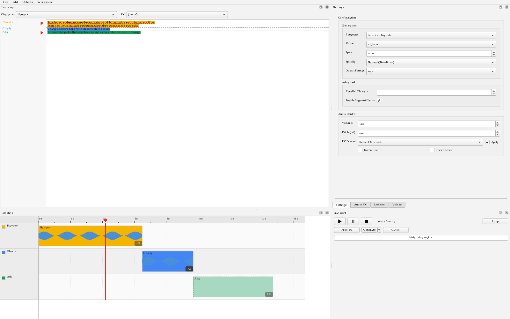

# Kokoro TTS GUI

A desktop text-to-speech app built with Python: a dockable PySide6 (Qt) interface over a pluggable
synthesis backend, edited less like a form and more like a DAW project, with a document of text,
timed clips on character tracks, and undo/redo. Powered by [Kokoro](https://github.com/hexgrad/kokoro)
by default, with a zero-shot voice-cloning backend also built in.



*(demo sounds better in `.wav` but GitHub doesn't support that so it's kinda bad)*

https://github.com/user-attachments/assets/c75e7141-5d73-40f4-b182-d4f5bc49ad1e

## New in Beta 4.1.0

The shell now matches the original wireframe: a 2x2 grid of docks, a real timeline, and playback.

-   **The 2x2 grid.** Transcript (top-left) | Settings / Audio FX / Lexicon / Voices tabs
    (top-right), Timeline (bottom-left) | Transport (bottom-right). Everything is still a dock you
    can drag; **Workspace > Advanced / Simple / Reset layout** are saved layouts. Simple hides the
    timeline and gives the transcript the full height, nothing else changes. The toolbar and the
    central button block are gone.
-   **Menus.** File (New / Open / Recent / Save / Save As / Import Text / Export), Edit (Undo / Redo /
    Cut / Copy / Paste / Characters...), Options (Engine, Device, Theme, copy/paste behavior, JIT),
    Workspace. The old Settings dialog folded into Options.
-   **Projects.** A project is a `.json` file in the `document.json` shape plus a
    `project_settings` block (export defaults). Launch reopens the last project; New inherits the
    previous project's characters; Import Text asks whether to add to the current project or start
    a new one. Autosave keeps writing to the current file; Save As branches it. The window title
    names the project and shows `*` while a save is pending.
-   **A stripped transcript panel.** The Input Source tabs, file path row, legacy preset row and
    Auto-Split row are gone. Above the editor sit two combos, Character and FX, that reflect the
    caret's clip and reassign the selection (or the whole clip) when changed. The gutter labels once
    per character/FX change, two lines (`Narrator` / `FX: Echo`), and shows a small play button
    beside each out-of-date clip: click it to regenerate just that clip. Out-of-date text is
    dash-underlined, and thin rules show where clips end and where Auto-split would cut.
-   **A timeline on a real seconds axis.** Clips sit end to end in text order across all tracks, at
    their real duration once generated and an estimated one (dashed outline, no waveform) before.
    The estimate learns from `generation_stats.json`. A ruler with a playhead, a fixed track-header
    column, Ctrl+wheel zoom. Dragging a clip pins it to a time; dragging it before an earlier clip
    also moves its text there. Shift+drag inside a clip still carves out a sub-range for TTS
    replacement.
-   **Playback.** Play / pause / stop, click the ruler to seek, a playhead across all lanes, and the
    transcript highlights and scrolls to the clip being played. Space toggles playback anywhere but
    the text editor; Ctrl+Space toggles everywhere. Built on one `sounddevice.OutputStream` that
    mixes the arrangement in the callback (`kokoro_gui/audio/transport.py`), so the position is
    sample accurate. Loop toggle included.
-   **Export.** File > Export mixes every clip down to one file (wav/mp3/flac/ogg) at its timeline
    position, optionally with a `.srt` and per-clip files (`<base>_001_Narrator.wav`). It warns when
    clips are out of date and offers to generate first. Output folder / filename / format moved here
    from the Settings tab.
-   **Audio FX follows the selection** like Settings does: project defaults, a character's preset
    (asks once before changing a preset every clip using that character shares), or a clip's
    override (slider drags become one undoable override). The timeline's FX button selects the clip
    and raises the tab.
-   **Light and dark themes** (Options > Theme). Custom-painted widgets read one palette module.
-   **Edit > Characters...** edits name, color, voice and FX preset for the project's characters.
-   Removed: the wall-clock playhead spike (`playhead_calc.py`, `WaveformPanel`). Tests that reached
    for `app.start_btn` / `app.generation_dock` now use `app.transport_dock` /
    `app.transcript_dock.editor`.

## New in Beta 4.0.0

-   **A document, not a text box.** The old single "generate this text" input is now a project: a
    `Document` of canonical text, plus the `Clip`/`Track`/`Character` metadata layered on top of it
    (`kokoro_gui/daw/`). Project state autosaves to `document.json`, separate from the app's
    `config_qt.json` settings file.
-   **Transcript panel with character highlighting and a live gutter.** The text editor colors each
    run by its assigned character, so speaker boundaries are visible without reading the inline
    `[Speaker:FX]:` syntax - which itself now converts into a real, colored assignment the moment you
    finish a tagged line (press Enter), not just when you generate. A left gutter shows "Character: X"
    (plus an FX marker) wherever it changes down the document, and its labels are clickable dropdowns
    for reassigning that clip on the spot - a right-click Characters menu remains as a secondary path.
    Copy/paste carries a selection's character assignment along (with a setting for whether a paste
    splits off its own run or inherits the destination's). Typing undoes/redoes like a normal text
    editor; character/FX assignments have their own undo history, and Ctrl+Z always reverts whichever
    happened most recently.
-   **A multi-track timeline.** One lane per character, clips rendered as colored blocks sized to
    their real audio duration once generated. Right-click a clip to generate or play it. Drag a clip
    onto a different character's track to reassign or move it. Drag inside a clip's waveform to carve
    out a sub-range and replace it with fresh TTS under any character, editable transcript included.
    Each clip has its own FX button (50%/90% opacity marks whether FX is active) for FX that override
    its character's preset.
-   **Auto-split on generation.** Turns a `[Speaker:FX]`-tagged document (optionally split further
    per paragraph) into clips automatically and generates them in one action, instead of assigning
    characters by hand first.
-   **Batch generation, scoped to what's actually stale.** Generate now regenerates every dirty clip
    in one pass, with bounded concurrency, rather than the whole document every time. A document with
    no clips yet still falls back to the original whole-document pipeline.
-   **Undo/redo.** The app's first menu bar (Edit > Undo/Redo) sits on top of a plain-Python
    undo stack backing text edits and character reassignments.
-   **A settings panel scoped to your selection.** The old always-global Generation fields
    (voice/speed/split pattern/format/etc., plus the volume/pitch/FX-preset/normalize/trim controls)
    now live in a dedicated Settings dock that reads and writes whatever's selected: the whole
    document's defaults, one clip's overrides, or a character's preset. Editing a character
    retroactively affects every clip using it, unless that clip has its own override.
-   **Characters replace bare presets in the UI.** Existing `presets/*.json` files migrate into
    `Character` objects on first load (one per file, or a single "Default" character seeded from
    your last settings if you had none), each with its own highlight color. The preset files
    themselves are untouched, so this is a safe downgrade path.
-   Not yet shipped: importing an existing audio recording and anchoring it to a transcript
    (ASR-anchored import) is planned as a follow-up, not part of this release.
-   **Second TTS engine, Audio8 (voice cloning).**
    [Audio8-TTS-Preview-0.6b](https://huggingface.co/Audio8/Audio8-TTS-Preview-0.6b), a zero-shot
    voice-cloning model, is now selectable from the engine picker alongside Kokoro. Unlike Kokoro's
    named voices, it clones a voice from a **reference WAV plus a transcript of what's said in it**,
    a Voice Reference dock (shown only for engines that support this) lets you browse a WAV,
    auto-transcribe it, edit the transcript, and save it under a name that then shows up in the
    normal Voice dropdown. The TTS model pulls in `transformers`/`torchaudio` (new `requirements.txt`
    entries) and loads with `trust_remote_code=True`. First use downloads it from Hugging Face.
-   **Two auto-transcription engines for Audio8's voice reference.** The Voice Reference dock's
    "Auto-Transcribe" button now has an engine picker (`kokoro_gui/engine/asr.py`, also runnable
    standalone as `python -m kokoro_gui.engine.asr <wav>`). Default is
    [Audio8-ASR-0.1B](https://huggingface.co/Audio8/Audio8-ASR-0.1B), online, higher quality, but
    CC-BY-NC-4.0 (non-commercial), worth knowing if you build on this fork commercially. The
    alternative is [Vosk](https://alphacephei.com/vosk), fully offline and Apache-2.0. Vosk needs a
    model folder downloaded from https://alphacephei.com/vosk/models; the dock has a field for it with
    Browse/Save/Reload buttons, but the value itself lives in `VOSK_MODEL_PATH` in a `.env` file at
    the project root (copy `.env.example`) rather than in `config_qt.json` like every other setting,
    since it's a one-time deployment detail rather than a per-session preference. Whatever WAV format
    the reference audio is in, it's converted to the 16-bit mono PCM Vosk requires before recognition
    runs, so you don't have to pre-convert it.
-   **Qt frontend, now the only frontend.** `python main.py`/`run.bat` launches a PySide6-based
    dockable-panel shell (`kokoro_gui/qt/`). The previous CustomTkinter app (`gui.py`) has been
    retired now that Qt reached parity. PySide6 is a regular dependency in `requirements.txt`.
-   **Modular codebase.** `kokoro_engine.py` is a slim core module backed by a `kokoro_gui/engine/`
    package split out by feature area (text extraction, caching, lexicon, presets, voice mixing),
    making the codebase easier to navigate and extend.

## New in Beta 3.2.0

-   **Cross-platform audio playback.** Preview and JIT playback now go through `sounddevice`/
    `soundfile` instead of the Windows-only `winsound` module, removing a hard Windows dependency
    from `kokoro_engine.py`.

## New in 3.1.0

-   **JIT (Just-In-Time) generation.** Real-time audio streaming. Start listening to your text
    immediately as it's being generated.
-   **Audio FX pipeline.** Integrated [Pedalboard](https://github.com/spotify/pedalboard) support
    for Reverb, Compression, and EQ.
-   **Pronunciation lexicon.** Create a custom dictionary to override how specific words or
    acronyms are pronounced.
-   **Advanced voice mixing.** Create unique custom voices by mixing existing ones with precise
    control.
-   **Scripted multi-speaker and FX.** Use a simple syntax `[Speaker:FX]: Text` to switch voices
    and audio effects on the fly.
-   **Intelligent caching.** Automatically caches generated segments to speed up repeated tasks.
-   **Windows quick start.** New `run.bat` for easy one-click startup on Windows.

## Features

-   **Document-based editing:**
    -   The transcript is the source of truth. Generated audio is a render of the document's
        current state, tracked per clip with cache-hash-based dirty detection.
    -   Multi-track timeline: one lane per character, drag clips to reassign or move them, carve
        out and replace a sub-range with fresh TTS.
    -   Undo/redo for text edits and character reassignments.
    -   Auto-split a `[Speaker:FX]`-tagged script into clips and generate them in one action.
    -   Batch-generate only what's stale, or fall back to whole-document generation for projects
        that don't use clips.
-   **Multi-source input:**
    -   **Direct text:** type or paste directly into the transcript panel.
    -   **File support:** load `.txt`, `.pdf`, and `.epub` files. Good for turning e-books into
        audiobooks.
-   **Two synthesis engines, one interface:**
    -   **Kokoro** (default): named base voices plus custom mixing, 8 languages, 24,000 Hz, one
        pipeline per worker thread for true parallel generation.
    -   **Audio8** (voice cloning): zero-shot cloning from a reference WAV + transcript, 44,100 Hz,
        one shared lock-serialized model.
    -   Both register behind the same backend abstraction, so switching engines (Options > Engine) swaps
        voices, sample rate, and the docks that make sense for that engine, live.
-   **Generation modes:**
    -   **Standard:** parallel batch processing across a thread pool.
    -   **JIT (real-time):** streamed generation with immediate playback, for engines fast enough
        to outrun playback.
-   **Audio FX and post-processing:**
    -   **Live FX (Pedalboard):** Compressor, Limiter, Gain, shelf EQ, high/low-pass filters, Reverb,
        Delay, Chorus, Distortion, Phaser, Clipping, Pitch Shift, Bitcrush, GSM Compressor.
    -   **Per-clip FX override**, layered on top of a character's own FX preset.
    -   **Traditional controls:** Speed (0.5x-2.0x), Volume, Pitch.
    -   **Cleanup:** Normalize and trim silence.
-   **Smart splitting:** split text by newlines, paragraphs, or sentences for better prosody at the
    seams.
-   **Flexible output:**
    -   Combine all segments into one final `.wav` (or `.flac`/`.mp3`/`.ogg`), or keep the individual
        segment files.
    -   **Subtitle export:** generate `.srt` files synced to the actual generated-segment durations.
    -   Custom output filenames and directories.
-   **Presets and characters:**
    -   Characters wrap the existing `presets/*.json` shape: name, voice, settings, and a highlight
        color, reusable across clips.
    -   Save and load FX presets separately from generation presets.
    -   Pronunciation lexicon: case-insensitive literal find-and-replace overrides, applied before
        synthesis.
-   **UI:** adjustable interface scaling and theme (Dark/Light/System), persistent dock layout.

## Prerequisites

-   **Python 3.11+**
-   **[eSpeak NG](https://github.com/espeak-ng/espeak-ng)**

## Installation

1.  **Clone the repository:**
    ```bash
    git clone https://github.com/CoffeeMethod/KokoroGUI.git
    cd KokoroGUI
    ```

2.  **Create a virtual environment (recommended):**
    ```bash
    python -m venv .venv
    # On Windows:
    .venv\Scripts\activate
    # On macOS/Linux:
    source .venv/bin/activate
    ```

3.  **Install dependencies:**
    ```bash
    pip install -r requirements.txt
    ```

    *Note: If you have issues with `torch`, visit [pytorch.org](https://pytorch.org/get-started/locally/)
    for specific installation instructions tailored to your OS and hardware.*

4.  **(Optional) Configure offline ASR:** copy `.env.example` to `.env` and set `VOSK_MODEL_PATH` if
    you plan to use the Vosk auto-transcription engine for the Voice Reference dock instead of the
    default (online, non-commercial) Audio8 ASR model.

## Usage

1.  **Run the application:**
    -   **Windows:** double-click `run.bat` or run `python main.py`
    -   **Other:** run `python main.py`

    This launches the PySide6 (Qt) frontend: a menu bar (File / Edit / Options / Workspace) over a
    2x2 grid of docks:

    -   **Transcript** (top-left): the editor, with Character and FX combos above it and a gutter
        that names the speaker and offers a per-clip regenerate button.
    -   **Settings / Audio FX / Lexicon / Voices** (top-right, tabbed): voice, speed, language and
        audio controls scoped to whatever's selected (document, clip or character); the Pedalboard
        chain, also scoped; pronunciation overrides; and the engine's voice tools (Mixing for
        Kokoro, Voice Reference for Audio8).
    -   **Timeline** (bottom-left): one lane per character on a seconds axis, ruler, playhead.
    -   **Transport** (bottom-right): play / pause / stop, Preview, Generate (with Auto-split in its
        menu), Cancel, and the progress line.

    The engine, compute device and theme live under **Options**; **Workspace** switches between
    the full grid and a Simple layout without the timeline.

2.  **Write and assign:**
    -   Type or paste text into the transcript, or File > Import Text for `.txt`/`.pdf`/`.epub`.
    -   Select a range and pick a character from the header combo (or the right-click Characters
        menu), or write inline `[Speaker:FX]: Text` tags and let Generate > Auto-split turn them
        into clips for you.
    -   Each character carries its own highlight color, visible right in the transcript.

3.  **Preview, generate, play, export:**
    -   Preview speaks a short sample of the current settings.
    -   Generate renders every out-of-date clip (or the whole document, for clip-free projects);
        the gutter's play buttons regenerate one clip at a time.
    -   Play (or Space) plays the arrangement; the timeline playhead and the transcript follow.
    -   Drag a clip on the timeline to move it in time, onto another lane to reassign it, or
        Shift+drag inside it to replace a sub-range with new TTS.
    -   File > Export mixes the timeline down to one file (plus optional `.srt` and per-clip files).
    -   Undo/redo any of the above from the Edit menu.

## Running Tests

The project has a `pytest` suite under `tests/` covering the DAW document model (`tests/daw/`), the
Qt frontend (`tests/gui_qt/`), and `kokoro_engine.py`. Playback isn't Windows-only (see
[`playback.py`](playback.py)), and CI (`.github/workflows/tests.yml`) runs the suite on both
`windows-latest` and `ubuntu-latest` (the Linux leg installs `libportaudio2` for `sounddevice`; the
Qt suite runs headless via `QT_QPA_PLATFORM=offscreen`, no virtual display needed). `macos-latest`
isn't set up yet.

1.  **Install test dependencies** (on top of `requirements.txt`):
    ```bash
    pip install -r requirements-test.txt
    ```

2.  **Run the fast suite** (default):
    ```bash
    pytest
    ```
    This mocks the Kokoro pipeline, so it runs in seconds with no model download and no eSpeak NG
    required. Caching is disabled by default in every test except `tests/test_caching.py`.

3.  **Run the integration suite** (opt-in, real synthesis):
    ```bash
    pytest -m integration tests/integration -s
    ```
    Uses the real Kokoro pipeline, so it needs eSpeak NG on `PATH` (see Prerequisites) and downloads
    model weights on first use. It skips automatically if `espeak-ng` isn't found. Since real
    synthesis can't be verified automatically, each test speaks a short, self-describing sample
    naming the voice/mode and writes it to `tests/output/<timestamp>/.../*_transcript.txt` next to
    the generated `.wav`, listen to the audio and compare against the transcript to confirm it
    sounds right. The `-s` flag also prints the same text to the terminal as each test runs.

### CI

[.github/workflows/tests.yml](.github/workflows/tests.yml) runs step 2 above (`pytest`) on push/PR
against `windows-latest` and `ubuntu-latest` (the Linux leg additionally installs `libportaudio2`, as
noted above) after installing `requirements.txt` + `requirements-test.txt`. The fast suite needs no
eSpeak NG or model download, so it's safe to run on every push/PR. The integration suite is slow and
pulls model weights, so it's intentionally left out as a manual/opt-in run rather than part of the
default pipeline.

## Technologies Used

-   **[Kokoro](https://github.com/hexgrad/kokoro):** The default TTS engine.
-   **[Audio8-TTS-Preview-0.6b](https://huggingface.co/Audio8/Audio8-TTS-Preview-0.6b):** The
    voice-cloning TTS engine.
-   **[Pedalboard](https://github.com/spotify/pedalboard):** Audio effects processing.
-   **[PySide6](https://doc.qt.io/qtforpython/):** The graphical user interface.
-   **PyTorch:** Deep learning backend.
-   **SoundFile / sounddevice:** Audio file I/O and cross-platform playback.
-   **PyPDF & EbookLib:** Document parsing.
