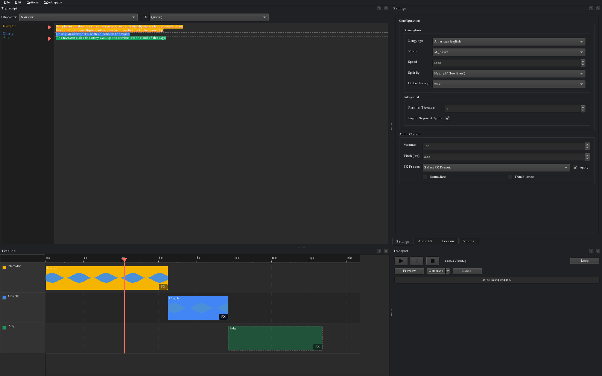

# Kokoro TTS GUI

[](https://github.com/CoffeeMethod/KokoroGUI/actions/workflows/tests.yml)
[](LICENSE)
[](https://www.python.org/downloads/)

A desktop text-to-speech app built with Python: a dockable PySide6 (Qt) interface over a pluggable
synthesis backend, edited less like a form and more like a DAW project, with a document of text,
timed clips on character tracks, and undo/redo. Powered by [Kokoro](https://github.com/hexgrad/kokoro)
by default, with a zero-shot voice-cloning backend also built in.



*(demo sounds better in `.wav` but GitHub doesn't support that so it's kinda bad)*

https://github.com/user-attachments/assets/c75e7141-5d73-40f4-b182-d4f5bc49ad1e

## Unreleased

-   **A character library shared by every project.** Characters can live in a library
    (`characters/`, one file per character) as well as in a project. A project's character linked
    to the library follows it: change its voice, FX or color in Edit > Characters and every
    project using it picks that up the next time it opens, or at once if it's open in another
    window. Each project keeps its own name for the character; "Rename in library" copies it
    over. Characters made in a project stay local to it until you press "Promote to Library".
    Add > From library... brings library characters into a project. A project still carries
    its own copy of every character, so it opens and plays on a machine whose library doesn't
    have one; the dialog then says "Library (not found here)".
-   **New starts from the library.** File > New gets every library character instead of a copy of
    the last project's. With an empty library you get one "Default" character. The first launch
    of this version copies your `presets/*.json` files into the library (the files stay), and
    characters in the project it opens that match a preset exactly are linked to it.
-   **Tracks appear when a character is used.** A character gets a timeline track the first time
    you assign it text, and a track with no clips isn't drawn, so a big library doesn't open as
    dozens of empty lanes. An unused track keeps its mute, fader and pan for when it comes back.
-   **Unified track layout.** Settings > Project > Track layout > Unified puts every clip on a
    few lanes (3 by default) and moves to the next lane each time the speaker changes, so a
    conversation alternates lanes. Mute, solo, fader and pan then act per lane. Switching back
    puts each clip on its character's track. Either switch is one undo step.
-   **Subprojects.** A project can hold other projects: File > New Subproject turns the selected
    text into a subproject embedded in this one (a chapter, an episode segment, a scene), and
    File > Add Subproject... links an existing `.tbaw`. The parent shows each as one read-only
    line and one block that plays the subproject's rendered mix. Click the block to edit the
    subproject in the transcript and Settings tabs; double-click to enter it on the timeline,
    with a breadcrumb back. Generate renders out-of-date subprojects after the parent's own
    clips. The New from text button makes an EPUB one subproject per chapter. Characters come
    in three scopes: Global (the library), Project (shared by every subproject of a book) and
    Local. A project with subprojects needs this version or newer to open.
-   **Each character picks its engine.** The Engine box in Edit > Characters replaces
    Options > Engine, so Kokoro and Audio8 voices can share a project. The Settings and Voices
    tabs follow the selected clip's character.
-   **Ripple on regenerate.** When a regenerated clip comes back longer or shorter, clips you
    placed by dragging that sit after it move by the same amount. Right-click a clip > Lock in
    time to keep it where it is, or turn ripple off in Settings > Project. Clips that overlap on
    one track get a red border.
-   **Subtitle import.** File > Import Subtitles... reads SRT, WebVTT and ASS/SSA files. Each cue
    becomes its own paragraph at the end of the transcript and a clip locked in time at the cue's
    start, with the cue's text as the clip's source text and the cue's length as its target.
    When the file names speakers (an ASS Name field, a VTT `<v Name>` tag), a dialog asks once
    which character voices each: the narrator, a new character named after the speaker, or one
    you already have. Cancel imports nothing, and one undo removes the whole import, including
    the characters it made. Ripple never moves a cue; dragging one moves it and it stays locked.
-   **Locked clips line up on their first word.** Settings > Project > "Align locked clips to
    their first word" starts a clip that's locked in time a little early, by the silence before
    its first word, so the word lands on the clip's time instead of the breath before it. It's on
    by default in a project with a locked clip, and skipped for a clip with Trim Silence on.
-   **Target durations and Fit to slot.** Settings > Clip > Target (s) gives a clip a length to
    fill; subtitle import sets it from each cue. The timeline draws that slot as a bracket, puts
    how full it is in the clip's label as a percentage, and tints the clip amber past 103% and red
    past 115%. Right-click > Fit to slot changes the clip until it's within 3% of the target:
    Kokoro regenerates it at a new speed (0.7x to 1.6x, up to three tries), and Audio8, which has
    no speed control, time-stretches it on playback (between 0.87x and 1.15x). A line still too
    long at that limit is marked Needs rewrite. Each fit is one undo step. "Fit all over slot"
    above the timeline, shown once any clip has a target, fits every clip that runs long. While
    you type, an out-of-date clip whose text reads longer than its target gets a wavy amber or
    red underline, judged from how fast each character has been speaking in this project.
-   **Original dialogue to dub against.** File > Import Source Track... copies the original
    recording into the project. Settings > Clip > Original (s) holds the part of it a clip dubs
    (`start - end`); subtitle import fills it from each cue's times. The transport's Dub /
    Original / Both switch picks what you hear: the dub, the original under each clip, or both
    at -6 dB each, and you can switch mid-play. It stays on Dub, greyed out, until the project
    has a source track. Settings > Project shows the source track, a Source offset (where the
    cue times start in the file) and Remove. Export is still the dub alone.
-   **Reference video.** File > Load Video... (MP4, MOV, MKV, WebM, AVI, M4V) opens a Video tab
    beside Settings that plays the video muted and follows the transport: play, pause, stop and
    seek. Its Offset box sets which video time sits at the timeline's 0. The project keeps the
    video's path, relative to the `.tbaw` when it can, and asks you to find the file if it has
    moved. "Bundle the reference video in the project file" in the Export dialog puts the video
    inside the `.tbaw` instead (off by default). Save only copies a video you picked with Load
    Video on this machine; a project someone sent you keeps the copy it came with. Workspace >
    Simple hides the tab.
-   **Convolution reverb.** Audio FX > Spatial & Time > Convolution Reverb puts a clip in a
    recorded space: pick an impulse response and set Mix (default 0.5). "Add..." copies a `.wav`
    into the impulse response library (`presets/fx/ir/`). Save bundles every impulse response the
    project uses, and a project's own copy wins over the library's. A missing one plays dry and
    logs a warning.
-   **Music beds with ducking.** File > Import Audio... > "Music bed" adds a WAV, FLAC, OGG, MP3 or
    AIFF file as a music bed on a Music track, locked in time at 0:00 or at the playhead, with its
    file name as a read-only line at the end of the transcript. Drag a bed's edges to trim it, and
    right-click for Loop (then drag the right edge to set how long it runs), Reset trim, Lock in
    time and Remove. The `D` button on a track's header ducks it: the track goes down while the
    clips on tracks without `D` play, by Settings > Project > Ducking (default -12 dB). The original
    dialogue neither ducks nor is ducked. Export sounds the same as playback. A project with
    imported audio needs this version or newer to open.
-   **Edit a recording as text.** File > Import Audio... > "Recording to edit as text" puts a
    recording's words in the transcript, each one tied to where it was said. The transcript
    comes from Whisper (in the background, with progress) or from an SRT, VTT or ASS caption
    file, optionally with "Refine word timing with Whisper". A review step lists each clip with a
    play button; a corrected word keeps its place in the recording. You pick one speaker for the
    whole recording from your voice-cloning characters, or "Unknown speaker"; a caption file's
    speaker names go through the same mapping dialog as subtitles. Then edit the text and the
    audio follows: delete words and the recording closes up with a 5 ms crossfade, cut, copy,
    paste or drag words and their audio moves with them (into another project too). Text you
    type inside a recording has no audio: it shows grey with a hollow circle in the gutter and
    splits the recording around it until you assign a character, which makes it an ordinary TTS
    clip. Recorded words have a faint underline and recording clips get a play button in the
    gutter. The recording is saved in the project under `audio/imported/`.

## New in 4.0.0-beta.3

-   **Pauses between clips.** Clips placed one after another now have 0.35 s of silence between
    them, and 0.9 s across a blank line. Both are in Settings > Project (Gap, Paragraph gap);
    set them to 0 for the old back-to-back placement. Every existing project that isn't
    hand-timed gets longer the first time you open it. A clip can override its own gap, and
    `[pause:1.5]` in a script gives the next clip Auto-split creates a 1.5 s gap. The marker
    stays in the text and is never read aloud.
-   **Takes.** Regenerating a clip keeps the old version. Right-click a clip > Take to switch
    back, or Delete take to drop one. A take recorded from text you've since edited says "old
    text". Old takes are saved in the project and their audio is kept. A project with takes
    needs this version or newer to open.
-   **Mixer.** Each track has mute, solo, a fader, a pan slider and a volume automation lane
    (the `A` button: double-click adds a point, drag moves it, right-click deletes it,
    Alt-drag moves a segment). Clips have fade-in and fade-out handles on their top corners.
    Settings > Project > Auto-crossfade adds a 10 ms fade where clips overlap. Playback and
    export are stereo, and export follows mute, solo, pan, fades and automation.
-   **Markers and loops.** Right-click the ruler to add a marker, and drag a flag to move it.
    Shift-drag on the ruler, or use "Loop to next marker", to loop a region. Export can render
    just the stretch between two markers.
-   **Timecode.** Settings > Project > Timecode shows the ruler and the transport clock as
    `HH:MM:SS:FF` at a frame rate you pick, drop-frame included, from any start time.
-   **Review.** Each clip has a status (to do, generated, approved, needs rewrite) and a note,
    set from the clip's right-click menu or Settings. The timeline's Show filter dims the rest.
    Export can write a cue sheet (`.csv`): times, character, source text, text, status, note.
-   **Source text for dubbing.** A clip can carry the original line it's dubbing. It shows in
    the transcript gutter's tooltip and next to a rough syllable count of both lines.
-   **Word timing.** Generated clips remember when each word is spoken: from Kokoro's own
    timings in English, and from a Whisper pass afterwards for Audio8 and Kokoro's other
    languages. During playback the transcript highlights the current word. Ctrl+click a word to
    jump there. Export can write one subtitle per word.
-   **Voice variants (Audio8).** A character can have named variants ("angry", "whisper"), each
    its own reference recording, set up in Edit > Characters. The transcript's Variant box picks
    one per clip.

## New in 4.0.0-beta.2

-   **The Lexicon applies to timeline clips.** Before, only whole-document and JIT generation
    used it. Adding or removing a rule now marks the clips whose text it rewrites as stale, and no
    others.
-   **Text splits at natural pauses, toward a word count.** Settings > Target Words per Segment
    (default 40) replaces Split By. Each piece ends at the strongest boundary near the target:
    a paragraph, then a sentence end, then a pause (comma, semicolon, colon, dash, line break),
    each with its own on/off switch. A sentence is only cut when it runs past twice the target,
    and a word never is. Each piece is one file and one subtitle cue, so a long paragraph no longer
    leaves a clip stale forever. Clips whose pieces come out different are marked stale; a
    `split_pattern` saved in a character preset is ignored.
-   **Whisper is the default auto-transcription engine.** The Voice Reference dock's
    Auto-Transcribe runs Whisper large-v3-turbo locally through faster-whisper (MIT). It asks
    before the first-use download (about 1.6 GB) and offers another engine instead. Set
    `WHISPER_MODEL` in `.env` to pick a smaller model. `python -m kokoro_gui.engine.asr ref.wav
    whisper --words` prints timed words. If you picked Audio8 in the dock before, that choice
    stays until you change it.
-   **Security.** On Linux and macOS, `cache/`, `custom_voices/` and the Audio8 reference folders
    are created (or tightened to) owner-only, 0700. A `cache/` that belongs to another user is
    left alone and a per-user one under `~/.cache/kokorogui/` is used instead.

## New in Beta 4.0.0

The rebuild. 3.2.0 was a CustomTkinter form over one `kokoro_engine.py`; 4.0.0 is a PySide6
shell over a document with clips, tracks and characters, a pluggable engine layer with a second
real backend, and projects that live in one file.

-   **Qt frontend, the only frontend.** `python main.py`/`run.bat` launches a PySide6 shell of
    dockable panels (`kokoro_gui/qt/`) in a 2x2 grid: Transcript | Settings / Audio FX / Lexicon /
    Voices tabs on top, Timeline | Transport underneath, under File / Edit / Options / Workspace
    menus. Every panel is a dock you can drag; **Workspace > Advanced / Simple / Reset layout** are
    saved layouts (Simple hides the timeline and gives the transcript the full height). The
    CustomTkinter app (`gui.py`) is gone; PySide6 is a regular dependency in `requirements.txt`.
-   **A document, not a text box.** The old "generate this text" input is a project: a `Document`
    of canonical text with `Clip`/`Track`/`Character` metadata layered on top (`kokoro_gui/daw/`).
    The transcript is the source of truth and generated audio is a render of it, tracked per clip
    with hash-based dirty detection. Generate regenerates every out-of-date clip in one pass with
    bounded concurrency instead of the whole document every time; a document with no clips yet
    still uses the whole-document pipeline. Auto-split turns a `[Speaker:FX]`-tagged document
    (optionally per paragraph) into clips and generates them in one action.
-   **Transcript panel with character highlighting and a live gutter.** Each run is tinted by its
    character, so speaker boundaries are visible without reading the inline `[Speaker:FX]:`
    syntax, which converts into a real assignment the moment you finish a tagged line. Above the
    editor sit two combos, Character and FX, that reflect the caret's clip and reassign the
    selection (or the whole clip). The gutter labels once per character/FX change (`Narrator` /
    `FX: Echo`) and shows a play button beside each out-of-date clip; click it to regenerate just
    that clip. Out-of-date text is dash-underlined, thin rules show where clips end and where
    Auto-split would cut. Copy/paste carries the character assignment along (with a setting for
    whether a paste splits off its own run or inherits the destination's).
-   **A multi-track timeline on a real seconds axis.** One lane per character; clips sit end to end
    in text order at their real duration once generated and an estimated one (dashed outline, no
    waveform) before, learned from `generation_stats.json`. A ruler with a playhead, a fixed
    track-header column, Ctrl+wheel zoom. Dragging a clip pins it to a time or moves it to another
    character's track; dragging it before an earlier clip also moves its text there. Shift+drag
    inside a clip carves out a sub-range and replaces it with fresh TTS under any character. Each
    clip has its own FX button for overrides to its character's preset.
-   **Playback.** Play / pause / stop, click the ruler to seek, a playhead across all lanes, and
    the transcript highlights and scrolls to the clip being played. Space toggles playback
    anywhere but the text editor; Ctrl+Space toggles everywhere. Built on one
    `sounddevice.OutputStream` that mixes the arrangement in the callback
    (`kokoro_gui/audio/transport.py`), so the position is sample accurate. Loop toggle included.
-   **Export.** File > Export mixes every clip down to one file (wav/mp3/flac/ogg) at its timeline
    position, optionally with a `.srt` and per-clip files (`<base>_001_Narrator.wav`). It warns
    when clips are out of date and offers to generate first. The dialog also holds the project's
    two bundle options: whether to bundle generated audio, and the audio format for new segments
    (wav or flac).
-   **`.tbaw` project bundles.** A project is one zip file that carries everything: the text and
    clips, every generated segment, and every named voice mix, voice reference and FX preset it
    uses, so it opens on another machine with the same engines installed. Save writes the whole
    file in the background (the progress line shows it) and never leaves a half-written project
    behind; Save As keeps the same working copy. Autosave writes only into the app's own working
    copy (`cache/projects/`), so the file on disk is as new as your last Save. Closing with
    unsaved changes asks Save / Discard / Cancel, and a crash offers to recover the unsaved
    session next time the project opens, even after the file was renamed or moved. Launch reopens
    the last project; New inherits the previous project's characters; Import Text asks whether to
    add to the current project or start a new one. The window title names the project and shows
    `*` while it has unsaved changes. A bundle only ever names audio inside itself: a
    `document.json` pointing at some other file on the machine reads as a missing segment, and
    Save never copies a file from outside the project's working copy into the bundle. (`.json`
    projects from the 4.0 previews still open and are converted on the spot, a `.tbaw` written
    next to the untouched `.json`, with matching audio carried over.)
-   **Generation writes once.** A clip's audio lands straight in the project's working copy under
    a name derived from what produced it, instead of one copy in `cache/` and another in the
    output folder. Regenerating a clip that's already up to date (the gutter button) makes a fresh
    take under a new name and leaves the old file for any other identical clip that plays it.
    Opening a project made with another version of an engine keeps its clips clean and says so in
    the status line; only clips you regenerate use the installed version.
-   **Welcome screen.** Launch opens the last project, then puts a dialog over it: recent projects
    (the open one first, Resume as the default button), New project, New from text file, Open
    other, right-click to drop a row, Clear list, and a details pane with the file's path,
    modified time, character and clip counts, audio length and engines. Untick "Show at startup"
    for a silent resume; File > Welcome... brings it up any time.
-   **Undo/redo.** Edit > Undo/Redo over a plain-Python undo stack. Typing undoes like a normal
    text editor; character/FX assignments and timeline moves have their own history, and Ctrl+Z
    reverts whichever happened most recently.
-   **Settings and Audio FX follow the selection.** The old always-global Generation fields
    (voice, speed, split pattern, plus volume/pitch/normalize/trim) live in a Settings dock that
    reads and writes whatever's selected: the whole document's defaults, one clip's overrides, or
    a character's preset. Editing a character affects every clip using it unless that clip has
    its own override. Audio FX works the same way (project defaults, a character's preset with a
    prompt before changing one that several clips share, or a clip override where slider drags
    become one undoable step); the timeline's FX button selects the clip and raises the tab.
-   **Audio FX are non-destructive.** Clips are generated as raw model output and the FX chain,
    volume, pitch, normalize and trim are applied when the transport, the export or the timeline
    waveform reads them. Move a slider, pick a preset, toggle "Apply": you hear it on the next
    play, the clip stays generated, nothing is marked out of date. The Audio FX tab and playback
    resolve a clip's stack through one function (`kokoro_gui/qt/fx_resolve.py`), and a clip with
    its own FX override counts as FX-on even if its character's preset says off.
-   **Characters replace bare presets.** Existing `presets/*.json` files migrate into `Character`
    objects on first load (one per file, or a single "Default" character seeded from your last
    settings if you had none), each with its own highlight color; Edit > Characters... edits
    name, color, voice and FX preset. The preset files themselves are untouched, so this is a safe
    downgrade path. Output folder, filename and format moved from the Settings tab to Export.
-   **Dark and light themes** (Options > Theme, dark by default). One palette module feeds the
    custom-painted widgets, the Qt palette and a stylesheet that styles every control: borderless
    setting groups, rounded inputs and buttons, an underlined tab strip, thin scrollbars, a flat
    progress line, painted play / pause / stop glyphs and a filled Generate button. The UI font
    is Segoe UI / Inter / Noto Sans at 10pt, the transcript one point larger. Timeline clips have
    rounded corners, a waveform in the clip's own darker shade and a label in black or white by
    contrast; the default character palette is eight hues at one lightness and doubles as the
    color picker's presets.
-   **Pluggable engines.** `kokoro_gui/engines/` defines a backend interface (config schema,
    voices, capabilities, project hooks) with three registered backends: Kokoro, Audio8 and a
    sine-tone Dummy that exists to prove the abstraction isn't Kokoro-shaped. Options > Engine
    swaps the Settings tab's fields and the Voices tab live. `kokoro_engine.py` is a slim core
    backed by a `kokoro_gui/engine/` package split by feature area (text extraction, caching,
    lexicon, presets, voice mixing, conversion, JIT, SRT).
-   **Second TTS engine, Audio8 (voice cloning).**
    [Audio8-TTS-Preview-0.6b](https://huggingface.co/Audio8/Audio8-TTS-Preview-0.6b), a zero-shot
    voice-cloning model, is selectable from Options > Engine alongside Kokoro. Unlike Kokoro's
    named voices, it clones a voice from a **reference WAV plus a transcript of what's said in it**;
    a Voice Reference dock (shown only for engines that support this) lets you browse a WAV,
    auto-transcribe it, edit the transcript, and save it under a name that then shows up in the
    normal Voice dropdown. The TTS model pulls in `transformers`/`torchaudio` (new
    `requirements.txt` entries) and loads with `trust_remote_code=True`. First use downloads it
    from Hugging Face.
-   **Two auto-transcription engines for Audio8's voice reference.** The Voice Reference dock's
    "Auto-Transcribe" button has an engine picker (`kokoro_gui/engine/asr.py`, also runnable
    standalone as `python -m kokoro_gui.engine.asr <wav>`). Default is
    [Audio8-ASR-0.1B](https://huggingface.co/Audio8/Audio8-ASR-0.1B), online, higher quality, but
    CC-BY-NC-4.0 (non-commercial), worth knowing if you build on this fork commercially. The
    alternative is [Vosk](https://alphacephei.com/vosk), fully offline and Apache-2.0. Vosk needs a
    model folder downloaded from https://alphacephei.com/vosk/models; the dock has a field for it
    with Browse/Save/Reload buttons, but the value itself lives in `VOSK_MODEL_PATH` in a `.env`
    file at the project root (copy `.env.example`) rather than in `config_qt.json` like every other
    setting, since it's a one-time deployment detail rather than a per-session preference. Whatever
    WAV format the reference audio is in, it's converted to the 16-bit mono PCM Vosk requires
    before recognition runs, so you don't have to pre-convert it.
-   **Segment cache rekeyed.** Cache entries are keyed on the voice's name and content rather than
    its path, so the first generate after upgrading from 3.2.0 misses the old `cache/` entries.
-   Not yet shipped: importing an existing audio recording and anchoring it to a transcript
    (ASR-anchored import) is a planned follow-up, not part of this release.

## New in 3.2.0

-   **Cross-platform audio playback.** Preview and JIT playback now go through `sounddevice`/
    `soundfile` instead of the Windows-only `winsound` module, removing a hard Windows dependency
    from `kokoro_engine.py`.

## New in 3.1.0

-   **JIT (Just-In-Time) generation.** Real-time audio streaming. Start listening to your text
    immediately as it's being generated.
-   **Audio FX pipeline.** Integrated [Pedalboard](https://github.com/spotify/pedalboard) support
    for Reverb, Compression, and EQ.
-   **Pronunciation lexicon.** Create a custom dictionary to override how specific words or
    acronyms are pronounced.
-   **Advanced voice mixing.** Create unique custom voices by mixing existing ones with precise
    control.
-   **Scripted multi-speaker and FX.** Use a simple syntax `[Speaker:FX]: Text` to switch voices
    and audio effects on the fly.
-   **Intelligent caching.** Automatically caches generated segments to speed up repeated tasks.
-   **Windows quick start.** New `run.bat` for easy one-click startup on Windows.

## Features

-   **Document-based editing:**
    -   The transcript is the source of truth. Generated audio is a render of the document's
        current state, tracked per clip with cache-hash-based dirty detection.
    -   Multi-track timeline: one lane per character in use (or a few shared lanes), drag clips to reassign or move them, carve
        out and replace a sub-range with fresh TTS.
    -   Undo/redo for text edits and character reassignments.
    -   Auto-split a `[Speaker:FX]`-tagged script into clips and generate them in one action.
    -   Batch-generate only what's stale, or fall back to whole-document generation for projects
        that don't use clips.
-   **Multi-source input:**
    -   **Direct text:** type or paste directly into the transcript panel.
    -   **File support:** load `.txt`, `.pdf`, and `.epub` files. Good for turning e-books into
        audiobooks.
    -   **Subtitles:** import `.srt`, `.vtt` and `.ass`/`.ssa` files as clips locked to each cue's
        time, with the cue's length as a target to fit.
    -   **Audio and video:** music beds with ducking, the original dialogue as a source track to
        dub against, and a reference video that plays along with the timeline.
-   **Two synthesis engines, one interface:**
    -   **Kokoro** (default): named base voices plus custom mixing, 8 languages, 24,000 Hz, one
        pipeline per worker thread for true parallel generation.
    -   **Audio8** (voice cloning): zero-shot cloning from a reference WAV + transcript, 44,100 Hz,
        one shared lock-serialized model.
    -   Both register behind the same backend abstraction. Each character picks its engine in Edit >
        Characters, so one project can mix Kokoro and Audio8 voices; the Settings and Voices tabs
        follow the selected clip's character.
-   **Generation modes:**
    -   **Standard:** parallel batch processing across a thread pool.
    -   **JIT (real-time):** streamed generation with immediate playback, for engines fast enough
        to outrun playback.
-   **Audio FX and post-processing** (non-destructive: applied on playback and export, never
    written into a generated clip, so changing them never regenerates anything):
    -   **Live FX (Pedalboard):** Compressor, Limiter, Gain, shelf EQ, high/low-pass filters, Reverb,
        Delay, Chorus, Distortion, Phaser, Clipping, Pitch Shift, Bitcrush, GSM Compressor, and
        a Convolution Reverb that takes your own impulse responses.
    -   **Per-clip FX override**, layered on top of a character's own FX preset, on top of the
        project's FX.
    -   **Traditional controls:** Speed (0.5x-2.0x), Volume, Pitch.
    -   **Cleanup:** Normalize and trim silence.
-   **Smart splitting:** text is generated in pieces of about 40 words (adjustable), cut at
    paragraphs, sentence ends or pauses (each switchable), never mid-word and mid-sentence only
    when a sentence runs past twice the target.
-   **Flexible output:**
    -   Combine all segments into one final `.wav` (or `.flac`/`.mp3`/`.ogg`), or keep the individual
        segment files.
    -   **Subtitle export:** generate `.srt` files synced to the actual generated-segment durations.
    -   Custom output filenames and directories.
-   **Presets and characters:**
    -   Characters wrap the existing `presets/*.json` shape: name, voice, settings, and a highlight
        color, reusable across clips. A global character library shares them between projects.
    -   Save and load FX presets separately from generation presets.
    -   Pronunciation lexicon: case-insensitive literal find-and-replace overrides, applied before
        synthesis on every path. Editing it marks the clips it affects as stale.
-   **UI:** dark or light theme, persistent dock layouts (Workspace menu).

## Prerequisites

-   **Python 3.11+**
-   **[eSpeak NG](https://github.com/espeak-ng/espeak-ng)**

## Installation

Two lines are available. Pick one before cloning.

| | 4.0.0 beta (recommended) | 3.2.0 (old stable) |
|---|---|---|
| What it is | The DAW-style rebuild described above: PySide6, characters and clips on a timeline, `.tbaw` projects, Kokoro + Audio8 | The previous CustomTkinter app: one text box, one voice, generate to a folder |
| Status | Beta. Under active development; bugs are expected and reports are welcome | Frozen. No further fixes |
| Project files | `.tbaw`. The plan is for every 4.x release to open a `.tbaw` from any earlier 4.x, with the beta included (that's a goal, not a guarantee, until 4.0.0 final) | None. Output is loose `.wav` files, nothing to carry forward |
| Presets, mixes, lexicon | `presets/*.json` load as characters; `custom_voices/` mixes and the lexicon carry over | As-is |

The two are separate codebases that share a name and the Kokoro model. There is no upgrade path
for a 3.2.0 install other than cloning 4.0.0 alongside it; there is nothing to migrate except the
`presets/` and `custom_voices/` folders, which you can copy across.

1.  **Clone the version you want:**

    4.0.0 beta:
    ```bash
    git clone --branch 4.0.0-beta.1 --depth 1 https://github.com/CoffeeMethod/KokoroGUI.git
    cd KokoroGUI
    ```
    `4.0.0-beta.1` is the tag of the current beta; the
    [Releases](https://github.com/CoffeeMethod/KokoroGUI/releases) page lists every version and
    has a source zip for each. Drop `--branch` to run the development branch instead.

    3.2.0:
    ```bash
    git clone --branch 3.2.0 --depth 1 https://github.com/CoffeeMethod/KokoroGUI.git
    cd KokoroGUI
    ```
    Then follow the README in that checkout, not this one: its dependencies, prerequisites and
    launch command differ.

2.  **Create a virtual environment (recommended):**
    ```bash
    python -m venv .venv
    # On Windows:
    .venv\Scripts\activate
    # On macOS/Linux:
    source .venv/bin/activate
    ```

3.  **Install dependencies:**
    ```bash
    pip install -r requirements.txt
    ```

    *Note: If you have issues with `torch`, visit [pytorch.org](https://pytorch.org/get-started/locally/)
    for specific installation instructions tailored to your OS and hardware.*

4.  **(Optional) Configure auto-transcription:** the Voice Reference dock's default engine is
    Whisper large-v3-turbo. Its model downloads from Hugging Face the first time you use it,
    about 1.6 GB, and the app asks before it starts. To use less, copy `.env.example` to `.env`
    and set `WHISPER_MODEL` to `small` (484 MB), `base` (145 MB) or `tiny` (75 MB). Set
    `VOSK_MODEL_PATH` there too if you want the fully offline Vosk engine. Whisper uses an NVIDIA
    GPU only when the CUDA 12 cuBLAS and cuDNN libraries are installed; without them it runs on
    the CPU (it tries the GPU once, then stays on the CPU).

## Usage

1.  **Run the application:**
    -   **Windows:** double-click `run.bat` or run `python main.py`
    -   **Other:** run `python main.py`

    This launches the PySide6 (Qt) frontend. A welcome dialog lists recent projects with Resume,
    New, New from text file and Open (untick "Show at startup" to skip it; File > Welcome...
    reopens it); its details pane reads a project's clip count, audio length and engines straight
    from the `.tbaw` manifest. Behind it, a menu bar (File / Edit / Options / Workspace) over a
    2x2 grid of docks:

    -   **Transcript** (top-left): the editor, with Character and FX combos above it and a gutter
        that names the speaker and offers a per-clip regenerate button.
    -   **Settings / Audio FX / Lexicon / Voices / Video** (top-right, tabbed): voice, speed,
        language and audio controls scoped to whatever's selected (document, clip or character);
        the Pedalboard chain, also scoped; pronunciation overrides; the engine's voice tools
        (Mixing for Kokoro, Voice Reference for Audio8); and the reference video, if the project
        has one.
    -   **Timeline** (bottom-left): one lane per character on a seconds axis, ruler, playhead.
    -   **Transport** (bottom-right): play / pause / stop, Preview, Generate (with Auto-split in its
        menu), Cancel, and the progress line.

    The engine, compute device and theme live under **Options**; **Workspace** switches between
    the full grid and a Simple layout without the timeline.

2.  **Write and assign:**
    -   Type or paste text into the transcript, or File > Import Text for `.txt`/`.pdf`/`.epub`.
    -   Select a range and pick a character from the header combo (or the right-click Characters
        menu), or write inline `[Speaker:FX]: Text` tags and let Generate > Auto-split turn them
        into clips for you.
    -   Each character carries its own highlight color, visible right in the transcript.

3.  **Preview, generate, play, export:**
    -   Preview speaks a short sample of the current settings.
    -   Generate renders every out-of-date clip (or the whole document, for clip-free projects);
        the gutter's play buttons regenerate one clip at a time.
    -   Play (or Space) plays the arrangement; the timeline playhead and the transcript follow.
    -   Drag a clip on the timeline to move it in time, onto another lane to reassign it, or
        Shift+drag inside it to replace a sub-range with new TTS.
    -   File > Export mixes the timeline down to one file (plus optional `.srt` and per-clip files).
        The same dialog holds the project's bundle options (bundle generated audio, wav or flac).
    -   File > Save writes the `.tbaw`; Ctrl+S is safe to hit any time, it runs in the background.
    -   Undo/redo any of the above from the Edit menu.

## Running Tests

The project has a `pytest` suite under `tests/` covering the DAW document model (`tests/daw/`), the
Qt frontend (`tests/gui_qt/`), and `kokoro_engine.py`. Playback isn't Windows-only (see
[`playback.py`](playback.py)), and CI (`.github/workflows/tests.yml`) runs the engine, DAW and
audio suites on both `windows-latest` and `ubuntu-latest` (the Linux leg installs `libportaudio2`
for `sounddevice`). The Qt suite runs headless via `QT_QPA_PLATFORM=offscreen`, no virtual display
needed, but only locally; CI skips `tests/gui_qt/`. `macos-latest` isn't set up yet.

1.  **Install test dependencies** (on top of `requirements.txt`):
    ```bash
    pip install -r requirements-test.txt
    ```

2.  **Run the fast suite** (default):
    ```bash
    pytest
    ```
    This mocks the Kokoro pipeline, so it runs in seconds with no model download and no eSpeak NG
    required. Caching is disabled by default in every test except `tests/test_caching.py`.

3.  **Run the integration suite** (opt-in, real synthesis):
    ```bash
    pytest -m integration tests/integration -s
    ```
    Uses the real Kokoro pipeline, so it needs eSpeak NG on `PATH` (see Prerequisites) and downloads
    model weights on first use. It skips automatically if `espeak-ng` isn't found. Since real
    synthesis can't be verified automatically, each test speaks a short, self-describing sample
    naming the voice/mode and writes it to `tests/output/<timestamp>/.../*_transcript.txt` next to
    the generated `.wav`, listen to the audio and compare against the transcript to confirm it
    sounds right. The `-s` flag also prints the same text to the terminal as each test runs.

### CI

[.github/workflows/tests.yml](.github/workflows/tests.yml) runs step 2 above on push/PR against
`windows-latest` and `ubuntu-latest` (the Linux leg additionally installs `libportaudio2`) after
installing `requirements.txt` + `requirements-test.txt`, as
`pytest --ignore=tests/gui_qt -p no:pytest-qt`: the engine, caching, DAW model, mixer and
transport tests, without the Qt widget suite. The fast suite needs no eSpeak NG or model download,
so it's safe to run on every push/PR. The integration suite is slow and pulls model weights, so
it's intentionally left out as a manual/opt-in run rather than part of the default pipeline.

## Contributing

See [CONTRIBUTING.md](CONTRIBUTING.md) for setup, the test conventions and what a PR needs.
Security reports go through the repository's Security tab, not Issues ([SECURITY.md](SECURITY.md)).

## Technologies Used

-   **[Kokoro](https://github.com/hexgrad/kokoro):** The default TTS engine.
-   **[Audio8-TTS-Preview-0.6b](https://huggingface.co/Audio8/Audio8-TTS-Preview-0.6b):** The
    voice-cloning TTS engine.
-   **[Pedalboard](https://github.com/spotify/pedalboard):** Audio effects processing.
-   **[PySide6](https://doc.qt.io/qtforpython/):** The graphical user interface.
-   **PyTorch:** Deep learning backend.
-   **SoundFile / sounddevice:** Audio file I/O and cross-platform playback.
-   **PyPDF & EbookLib:** Document parsing.
