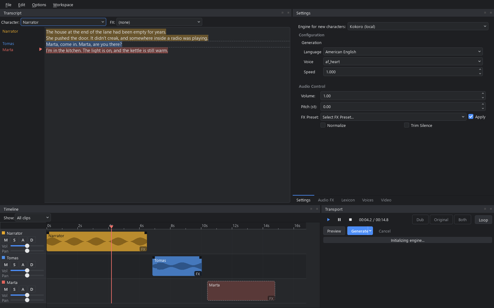

# KokoroGUI

[](https://github.com/CoffeeMethod/KokoroGUI/actions/workflows/tests.yml)
[](LICENSE)
[](https://www.python.org/downloads/)

A text-based audio workflow. Edit the words and the audio follows: write or import a transcript,
give each line a character, and the clips land on a timeline you can mix and export. Change a word
and only that clip generates again. It runs locally on [Kokoro](https://github.com/hexgrad/kokoro),
with Audio8 voice cloning and optional LuxTTS support.



*(demo sounds better in `.wav` but GitHub doesn't support that so it's kinda bad)*

https://github.com/user-attachments/assets/c75e7141-5d73-40f4-b182-d4f5bc49ad1e

## Features

-   **Transcript first.** Type, paste or import `.txt`, `.pdf`, `.epub` or subtitles. Each run of
    text belongs to a character, and only the clips whose text or voice changed need generating
    again.
-   **Timeline and mixer.** One track per character, with mute, solo, fader, pan, automation,
    fades, markers, loops and timecode.
-   **Multiple engines.** Kokoro's named and mixable voices in 8 languages, Audio8 voice cloning,
    and optional LuxTTS. Each character picks its own.
-   **Non-destructive FX.** A Pedalboard chain (compressor, EQ, reverb, convolution reverb, delay
    and more) applied on playback and export, per project, character or clip.
-   **Dubbing.** Subtitle import, fit-to-slot timing, the original dialogue and a reference video
    to play against.
-   **Recordings and music.** Edit a recording by editing its transcript, and add music beds that
    duck under speech.
-   **Export.** One file in wav, mp3, flac, ogg or (with ffmpeg on PATH) m4b, with `.srt` subtitles and a cue sheet, optionally
    normalized to a LUFS or RMS target under a true-peak ceiling or a peak limiter, with an MP3 bitrate, a sample rate
    and a filename template. Presets for ACX, Apple Podcasts, Spotify and YouTube check each file, and one export can
    write a file per subproject or marker range. Stems come per track or per character, with a dialogue stem for
    dubbing. Transcripts (WebVTT, SRT, Podcasting 2.0 JSON, plain text), a chapters file and show notes can ride along.
    mp3, flac and ogg files carry a title, artist, show, episode number and cover image, and an mp3 carries its chapters.
    An M4B audiobook has a chapter per subproject. File > Measure Loudness reports the numbers.
-   **Generation queue.** Generate works through the stale clips eight at a time, so a book fills in as it goes. The
    Queue tab lists the batches with the time left, and you can pause, reorder and resume them, even after a restart.
-   **Proofing.** The Proof tab has Whisper listen to the generated clips, compares what it heard with each clip's
    text and lists the ones that don't match, worst first.
-   **One-file projects.** A `.tbaw` holds the text, the audio and every voice it uses, so it opens
    on another machine.

## What's new

Unreleased:

-   Generate fills a book in as it goes: the stale clips run eight at a time, a Queue tab lists the batches with the time
    left, and Pause, reorder and Resume work on them, even after a restart
-   Added the optional [LuxTTS engine](docs/settings.html#luxtts).
-   A Help menu with Documentation, Keyboard Shortcuts and About, and File > Show in Folder
-   A log file, and a dialog with the traceback when something crashes
-   Importing a big book no longer freezes the window, and an oversized or malformed one is refused with the reason
-   Generate stale clips in the selection only, a taskbar alert when a long job finishes, and a
    prompt before closing mid-generate
-   Split a clip in two at the playhead and join two clips back, from Edit, the block menu or `S`
-   Keys for the transport and timeline (arrows, Home, End, J/K/L, Delete, Ctrl+G, Esc) that work only with the timeline
    focused, with Ctrl+Alt versions of the arrows, Home and End for any panel, and a Snap to grid button that also snaps to markers
-   Edit > Remove Filler Words finds um, uh and the like in a recording, lets you check each one and play it, and cuts them in one undo step
-   Export can normalize to a LUFS target, File > Measure Loudness reports a mix, and the transport has a level meter
-   The Export dialog has tabs, an MP3 bitrate, a sample rate and a filename template, and asks before it overwrites a file
-   Export presets for ACX, Apple Podcasts, Spotify and YouTube that check each file, an RMS mode with a peak limiter,
    head and tail silence, and one file per subproject or marker range
-   An Outline tab that lists a book's chapters with a status and a length, and proofs one in a click
-   Importing a book opens a wizard: tick the sections to keep, pick cleanup rules for page numbers, split words
    and scene breaks, and check the result before it lands in the project
-   A Zoom to fit button, a timeline that zooms out to ten hours in one screen, and a project that reopens at its
    last playhead, zoom, scroll and selected clip
-   Export can write a stem per track or per character and a dialogue stem without the music, all the length of the mix
-   Export can write transcripts with speaker names (WebVTT, SRT, Podcasting 2.0 JSON, plain text), a chapters file and show notes
-   Sliders for compressor and limiter release, compressor attack, reverb dry level, chorus mix and phaser depth and mix
-   Export writes tags and a cover image into mp3, flac and ogg files, and markers as chapters in an mp3
-   A Proof tab that has Whisper listen to the generated clips and flags those that don't match their text
-   Export can write an audiobook as one M4B with a chapter per subproject, the tags and the cover (needs ffmpeg on PATH)
-   Lexicon rules can match a whole word or a regex pattern and run in an order you set, and a Test field shows a
    sentence after the rules and how Kokoro will read it
-   Lexicon > Find words to check lists the names, acronyms and numbers in a book, plays each in its sentence, and adds
    a whole-word rule for every answer you type
-   Options > Spellcheck underlines words the dictionary doesn't know, in the language of each clip's character
-   The window says FX, Character, Reference, Mix and stale where it said FX Preset, Preset, voice reference, custom voice and dirty
-   Chapter and heading gaps, heading speed, a varied gap between speakers, and `[Sam, overlap:0.3]:` to start a line over the one before it
-   Playback runs at 0.5x to 2x with the voices keeping their pitch (a speed box in the transport, `[` and `]`, and `L`
    steps 1x, 1.5x, 2x), `M` drops a flag at the playhead with an optional note, and `N` jumps to the next flag

In 4.0.0-beta.2:

-   Subtitle import, Fit to slot, the original dialogue and a reference video, for dubbing
-   A mixer: mute, solo, faders, pan, automation, fades and crossfades, in stereo
-   Takes, pauses between clips, and ripple when a regenerated clip changes length
-   A character library shared by every project, and an engine choice per character
-   Subprojects, so a book can be one project per chapter
-   Music beds with ducking, and editing a recording as text
-   Convolution reverb, markers, loops, timecode and word-by-word highlighting
-   Whisper as the default transcriber, and text split at sentence ends near a word count
-   An Engine row in Settings, a Voices tab for any engine, and each engine's own language and
    model settings
-   Kokoro optional: a project whose engine isn't installed opens and plays, and engines can be
    plugins
-   Transcript details (Options menu): segment boundaries, lexicon rewrites, gaps, and each clip's
    length and status
-   Typing, scrolling and timeline updates stay fast in long projects, plus Options > Force refresh
-   A clip made from a `[Speaker:FX]:` line no longer reads the tag aloud, and the tag's FX is
    applied to the clip
-   On Windows, an impulse response name with a colon is refused instead of loading a different file
-   Options > Settings... holds the program and project settings in an OBS-style window; the
    Settings tab keeps only the voice
-   An FX change in a long project renders in the background instead of freezing the window, and
    undoing a character change or a text replace copies only what the edit touched

The [changes page](docs/changes.html) has the full detail for every version, including what the
update does to existing projects.

## Install

You need Python 3.11+ and [eSpeak NG](https://github.com/espeak-ng/espeak-ng). To export M4B audiobooks you also
need [ffmpeg](https://ffmpeg.org/download.html) on your PATH. Without it the M4B format doesn't appear in the
Export dialog.

```bash
git clone --branch 4.0.0-beta.2 --depth 1 https://github.com/CoffeeMethod/KokoroGUI.git
cd KokoroGUI
python -m venv .venv
.venv\Scripts\activate          # Windows
source .venv/bin/activate       # macOS / Linux
pip install -r requirements.txt
```

`4.0.0-beta.2` is the latest beta tag. `--branch` takes a tag name, and dropping it gets the default branch. If `torch` gives you trouble, follow
[pytorch.org](https://pytorch.org/get-started/locally/) for your OS and GPU.

Kokoro is optional. Without the `kokoro` package (and eSpeak NG) the app
runs Audio8 and the test engine, and a Kokoro project opens and plays but doesn't generate.

Models download from Hugging Face the first time you use them. Whisper, the transcriber, is about
1.6 GB and the app asks first. For a smaller one, copy `.env.example` to `.env` and set
`WHISPER_MODEL` to `small`, `base` or `tiny`. `VOSK_MODEL_PATH` there switches on the offline
Vosk engine.

Looking for 3.2.0, the old one-text-box app? It's frozen. Clone the `3.2.0` tag with `--branch 3.2.0` and follow
the README in that checkout. Only `presets/` and `custom_voices/` carry over between the two.

## Usage

Run `python main.py`, or double-click `run.bat` on Windows.

1.  Pick a recent project from the welcome dialog, or start a new one.
2.  Type or import text, select a range and choose a character. Or type `[Marta]:` at the start
    of a line, and Generate > Auto-split turns a tagged transcript into clips.
3.  Press Generate. Only stale clips generate.
4.  Press Space to play. Drag clips on the timeline to move them.
5.  File > Export writes the audio file. File > Save writes the `.tbaw`.

The [docs site](docs/index.html) covers the workflows, every setting, tags and the `.tbaw`
format.

## Tests

```bash
pip install -r requirements-test.txt
pytest                                     # fast suite, mocked, no model needed
pytest -m integration tests/integration -s # real generation, needs eSpeak NG
```

CI runs the fast suite on Windows and Ubuntu, without the Qt widget tests. Those run locally,
headless. The integration tests write each sample next to a transcript under `tests/output/` for
you to listen to.

## Contributing

See [CONTRIBUTING.md](CONTRIBUTING.md). Security reports go through the repository's Security tab,
not Issues ([SECURITY.md](SECURITY.md)).

## Built with

[Kokoro](https://github.com/hexgrad/kokoro),
[Audio8-TTS](https://huggingface.co/Audio8/Audio8-TTS-Preview-0.6b),
[Pedalboard](https://github.com/spotify/pedalboard),
[PySide6](https://doc.qt.io/qtforpython/), PyTorch, SoundFile and sounddevice, PyPDF and
EbookLib.
